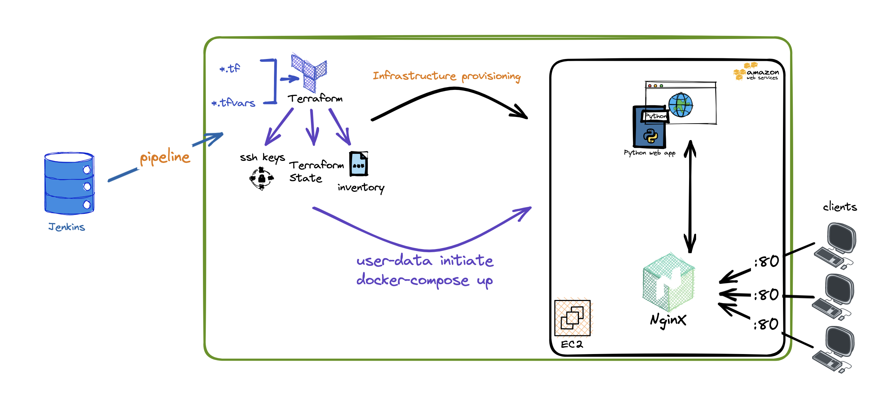

# LAB-OS
DevOps Engineer Home Challenge for @LAB-OS

- [Project purpose and architecture](#architecture)
- [Technologies used](#tech)
- [Deployment ](#deploy)
- [The tests ](#tests)
- [How to use](#how-to)
- [Future](#Future)

# Project purpose
DevOps Engineer Home Challenge for @LAB-OS
As part of this Home assignment, I was required to create a web-app behind an NginX proxy, that returns release versiono of any GitHub repository using GitHub API.

# Architecture

 
Versatile web app  CICD flow involves the following stages:   

1. `Deploy`  
In this stage, we deploy an EC2 instance to aws, using terraform aws module 
2. `verify` 
In this stage, we verify that the EC2 instance was created succesfully 
3. `Install`  
In this stage, we install our web application on top of the EC2 using ansible whcih runs docker-compose to initiate a docker container that holds our web app  
4. `Test`  
In this stage, we test the functionality of the web-app  
such as:  
    4.1 Health Checks
    4.2 Health Checks
    4.3 Health Checks
5. `Release`  
In this stage, we release the image as artifact to dockerhub.  
This image containes the latest of our code
6. `Destroy` 
On development branches only (pipelines that came from any other branch but `main`)
the pipeline will kill the EC2 machine that was created after 10 minuets

as for production, the 

# Deployment
To deploy development enviornemt:
1. Login to jenkins in http://13.38.117.100:8080/job/versatile-app-build-test-deploy/
2. Go to versatile-app-build-test-deploy job
3. Press on your development branch
4. Build with Parameters
5. set Region and 'build'

Deployment to production will happen only after a succesful merge to main branch

## Deploy locally (installing web-app only)
    pre-requisites:
        docker | docker-compose | python | virtualenv | pip | git

    git clone clone https://github.com/KobeVK/Versatile
    cd Versatile && docker-compose up

# The tests
1. health check

# Artifacts
The product is the web-app containerized and pushed to docker hub.
auto versioned by the Jenkins job number  
 https://hub.docker.com/r/sapkobisap/versatile   

# Future work
1. Enable more parameters in Gitlab to support wider range of deployemt possibilites (not just free-tier EC2's)
2. Fix folder structure to better visibility (ansible files, TF files, Docker files)
3. add proxy such as NginX
4. Infrastructure tests (Load on server, high traffic, etc...)
5. add Python unit tests, (maybe mock's with pupeteer...)